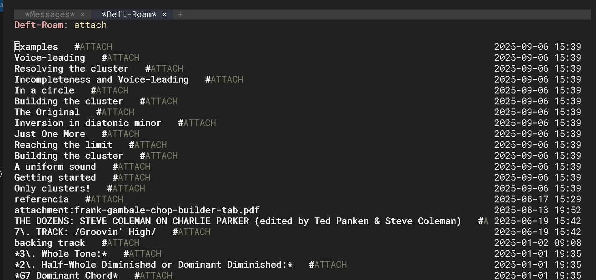

# Deft-Roam

*Deft-Roam* is an adaptation of [Deft](https://github.com/jrblevin/deft) designed to work directly with the [Org-roam](https://github.com/org-roam/org-roam) database.  
It combines Deft's instant-search experience with Org-roam's node-based architecture — without reading or parsing files from disk.

---

## Overview

Deft-Roam provides a lightweight, fast search and navigation interface over all nodes registered in the Org-roam database.  
It loads all node metadata once from SQLite and performs all filtering in memory, similar to *org-roam-ui*.

Built to:
- Minimize startup latency  
- Eliminate repeated filesystem I/O  
- Keep results up to date with incremental refresh  
- Maintain smooth search performance using background threads and debounce  

---



##  Key Features

### Direct Org-roam Database Query
All nodes and tags are fetched in one query:
```elisp
(org-roam-db-query
 [:select [id file title (funcall group-concat tag (emacsql-escape-raw \,))]
  :from nodes
  :left-join tags :on (= id node_id)
  :group :by id])
```

### Persistent mtime cache
Avoids repeated `file-attributes` calls using a session hash table.

### Asynchronous incremental filtering
Filtering runs in threads with 250 ms debounce, keeping UI responsive even with thousands of notes.

### Instant header updates
Typed characters appear immediately; the search results update asynchronously.

### Incremental refresh
`C-c C-g` compares mtimes to update only changed or new nodes.

### Sort toggle
Switch between sorting by title or modification time with `C-c C-s`.

### Inline tags with hashtags
Tags appear next to the title (e.g. `#analysis #jazz`) using a softer, italicized face.

### Familiar Deft-style UX
Incremental search, navigation with `TAB`/`S-TAB`, case-insensitive search, and enter-to-open remain unchanged.

---

##  Keybindings

| Key           | Action                          |
|---------------|---------------------------------|
| `RET`         | Open selected node              |
| `TAB` / `S-TAB` | Navigate results              |
| `DEL`         | Delete last character           |
| `C-c C-l`     | Enter full filter string        |
| `C-c C-c`     | Clear filter                    |
| `C-c C-s`     | Toggle sort (mtime/title)       |
| `C-c C-g`     | Refresh changed nodes           |
| `C-c C-q`     | Quit window                     |

---

##  Installation

You can install **Deft-Roam** directly from GitHub using `straight.el` or manually.

### Using `straight.el`

Add the following snippet to your Emacs configuration:

```elisp
(straight-use-package
 '(deft-roam :type git :host github :repo "crlsh/deft-roam"))
```

Then launch with:

```elisp
M-x deft-roam
```

### Manual Installation

Clone the repository and add it to your load path:

```bash
git clone https://github.com/crlsh/deft-roam.git
```

```elisp
(add-to-list 'load-path "~/path/to/deft-roam")
(require 'deft-roam)
```

---

##  Requirements

- Emacs 28+
- Org-roam v2
- SQLite database available

---

## Comparison with Deft

| Aspect         | Deft (original)        | Deft-Roam                      |
|----------------|------------------------|--------------------------------|
| Data source    | Filesystem scan        | Org-roam SQLite                |
| Load method    | File read              | SQL query                      |
| Content shown  | First line             | Title + tags + mtime           |
| Filtering      | Synchronous            | Async (threads + debounce)     |
| Metadata       | None                   | ID, tags, title, mtime         |
| Display        | Plain list             | Enhanced line with #tags       |

---

##  Example Output

```
Progresión del Ejemplo 27: #music-book #harmony
09-78-03 How Charlie Parker Uses Chromatic Notes #analysis #jazz
Ejemplo Nº 15 #music-book
```

---

##  License

MIT License  
Based on Deft © Jason Blevins  
Adapted for Org-roam by Carlos Gimenez
